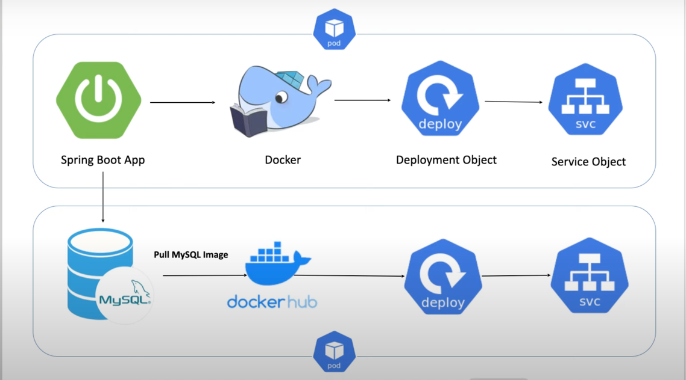

## Run & Deploy Spring Boot CRUD Application With MySQL on K8S

Original Tutorial here: https://github.com/Java-Techie-jt/springboot-crud-k8s/blob/main/README.md

A high level overview is provided below:

